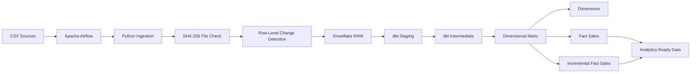

# Snowflake-Powered E-Commerce Data Warehouse

An end-to-end data engineering project that ingests e-commerce source data into Snowflake, performs incremental and idempotent loading, transforms raw data into analytics-ready dimensional models with dbt, orchestrates the pipeline with Apache Airflow, and implements automated CI/CD using GitHub Actions.

The project demonstrates practical implementation of modern data engineering patterns including **incremental ingestion, change detection, data quality testing, dimensional modelling, workflow orchestration, environment isolation, Git-based development, and automated deployment**.

---

## Architecture



### Data flow

```text
CSV Sources
     ↓
Apache Airflow
     ↓
Python Ingestion
     ↓
File-Level Duplicate Detection
     ↓
Row-Level New / Changed Record Detection
     ↓
Snowflake RAW
     ↓
dbt Staging
     ↓
Intermediate Deduplication
     ↓
Dimensional Models
     ↓
Analytics-Ready Data
```

---

## Technology Stack

| Area                 | Technology                            |
| -------------------- | ------------------------------------- |
| Programming          | Python, SQL                           |
| Cloud Data Warehouse | Snowflake                             |
| Transformation       | dbt                                   |
| Orchestration        | Apache Airflow                        |
| Containerisation     | Docker, Docker Compose                |
| Version Control      | Git, GitHub                           |
| CI/CD                | GitHub Actions                        |
| Data Modelling       | Dimensional Modelling, Star Schema    |
| Data Quality         | dbt generic and singular tests        |
| Security             | Environment Variables, GitHub Secrets |

---

## Source Data

The pipeline processes four e-commerce datasets:

* `customers.csv`
* `products.csv`
* `orders.csv`
* `order_items.csv`

Each dataset is loaded into a corresponding Snowflake RAW table.

```text
customers.csv
    ↓
RAW_CUSTOMERS

products.csv
    ↓
RAW_PRODUCTS

orders.csv
    ↓
RAW_ORDERS

order_items.csv
    ↓
RAW_ORDER_ITEMS
```

---

# Ingestion Architecture

The Python ingestion layer implements both **file-level idempotency** and **row-level change detection**.

## File-Level Duplicate Detection

A SHA-256 hash is generated for each source file.

The ingestion audit table stores information about processed files so repeated processing of unchanged input files can be detected.

```text
Source File
    ↓
Calculate SHA-256
    ↓
Check ingestion history
    ↓
Already processed?
    ├── Yes → Skip
    └── No  → Process
```

This prevents unnecessary repeated ingestion when the same source file is encountered again.

---

## Row-Level Incremental Loading

A changed source file does not automatically cause every row to be inserted again.

Instead, staged records are compared against the latest RAW records using dataset-specific business keys:

| Dataset     | Business Key    |
| ----------- | --------------- |
| Customers   | `customer_id`   |
| Products    | `product_id`    |
| Orders      | `order_id`      |
| Order Items | `order_item_id` |

The ingestion process identifies:

```text
New business key
       ↓
INSERT

Existing key + changed attributes
       ↓
INSERT new version

Existing key + unchanged attributes
       ↓
SKIP
```

This retains RAW history while avoiding unnecessary duplicate versions of unchanged records.

---

## Pipeline Metadata and Auditing

Ingested records contain operational metadata including:

```text
_source_file
_ingestion_timestamp
_pipeline_run_id
```

A single pipeline execution uses the same pipeline run ID across the files processed during that run.

The `INGESTION_FILE_LOG` table records file-processing information and supports ingestion auditing and duplicate-file detection.

---

# Snowflake RAW Layer

The cleaned RAW schema contains only ingestion-layer objects:

```text
RAW
├── RAW_CUSTOMERS
├── RAW_PRODUCTS
├── RAW_ORDERS
├── RAW_ORDER_ITEMS
└── INGESTION_FILE_LOG
```

Transformation models are deliberately separated from RAW.

---

# dbt Transformation Layer

dbt transforms the historical RAW data through three logical layers.

```text
RAW
 ↓
STAGING
 ↓
INTERMEDIATE
 ↓
MARTS
```

## Staging

The staging layer provides clean interfaces over RAW source tables.

Models include:

```text
stg_customers
stg_products
stg_orders
stg_order_items
```

---

## Intermediate

Because RAW retains changed versions of records, intermediate models identify the latest record for each business key.

Models include:

```text
int_customers_deduped
int_products_deduped
int_orders_deduped
int_order_items_deduped
```

Deduplication uses window functions such as:

```sql
ROW_NUMBER() OVER (
    PARTITION BY business_key
    ORDER BY
        _ingestion_timestamp DESC,
        _pipeline_run_id DESC
)
```

This provides the latest business state while preserving historical records in RAW.

---

# Dimensional Data Warehouse

The marts layer produces analytics-ready dimensional models.

```text
                 DIM_CUSTOMERS
                      │
                      │
DIM_DATE ─────── FACT_SALES ─────── DIM_PRODUCTS
```

Models include:

```text
DIM_CUSTOMERS
DIM_PRODUCTS
DIM_DATE
FACT_SALES
FACT_SALES_INCREMENTAL
```

The fact table operates at the **order-item grain**, allowing individual products within an order to be analysed independently.

---

## Incremental Fact Processing

`FACT_SALES_INCREMENTAL` uses dbt incremental materialisation with a merge strategy.

Conceptually:

```text
New/updated transformed records
             ↓
        dbt incremental
             ↓
      Snowflake MERGE
        ↙           ↘
   MATCHED        NEW
      ↓             ↓
   UPDATE         INSERT
```

The model uses:

```text
order_item_id
```

as its unique key.

Change timestamps account for relevant upstream records so changes such as an updated order status can propagate into the incremental fact even when the associated order-item record itself has not changed.

---

# Data Quality

Data quality is integrated directly into the dbt pipeline.

Tests include:

* `not_null`
* `unique`
* `relationships`
* `accepted_values`
* custom singular business-rule tests

Examples include validating:

```text
Primary/business keys are populated
        ↓
Keys expected to be unique remain unique
        ↓
Fact foreign keys resolve to dimensions
        ↓
Order status contains accepted values
        ↓
Sales values satisfy business rules
```

dbt tests execute as part of both orchestration and CI/CD validation.

---

# Airflow Orchestration

Apache Airflow orchestrates the end-to-end data pipeline.

The main DAG follows:

```text
ingest_to_snowflake
        ↓
     dbt_run
        ↓
     dbt_test
```

The ingestion task executes the Python Snowflake loader.

After successful ingestion, Airflow executes dbt transformations followed by automated data-quality tests.

A failed task prevents dependent processing from being treated as successfully completed.

The Airflow environment is containerised using Docker Compose.

---

# Environment Separation

The project implements separate **development, CI, and production transformation environments** inside Snowflake.

```text
                         RAW
                          │
          ┌───────────────┼───────────────┐
          ↓               ↓               ↓
         DEV              CI             PROD
          │               │               │
    DEV_STAGING      CI_STAGING      PROD_STAGING
          ↓               ↓               ↓
 DEV_INTERMEDIATE  CI_INTERMEDIATE  PROD_INTERMEDIATE
          ↓               ↓               ↓
     DEV_MARTS        CI_MARTS        PROD_MARTS
```

### DEV

Used for local development and validation.

```text
DEV_STAGING
DEV_INTERMEDIATE
DEV_MARTS
```

### CI

Used by GitHub Actions when validating proposed changes.

```text
CI_STAGING
CI_INTERMEDIATE
CI_MARTS
```

### PROD

Used by the automated deployment workflow after validated changes reach the `main` branch.

```text
PROD_STAGING
PROD_INTERMEDIATE
PROD_MARTS
```

Environment-aware schema generation is implemented through a custom dbt `generate_schema_name` macro.

---

# Git Development Workflow

Development follows a feature-branch workflow.

```text
main
 │
 └── feature/*
        │
        ├── development
        ├── local validation
        └── commit + push
                ↓
          Pull Request
                ↓
          GitHub Actions CI
                ↓
          Required check
                ↓
              Merge
                ↓
               main
```

The `main` branch is protected using repository rules.

Changes are expected to go through a pull request and the required CI validation check must succeed before merging.

Force pushes and destructive changes to the protected branch are restricted.

---

# Continuous Integration

GitHub Actions automatically validates changes associated with the development workflow.

The CI pipeline performs:

```text
Checkout repository
        ↓
Configure Python
        ↓
Install pinned dependencies
        ↓
Validate Python source
        ↓
Create secure dbt CI profile
        ↓
Validate dbt profile
        ↓
Test Snowflake connection
        ↓
dbt parse
        ↓
dbt build
        ↓
Models + Data Quality Tests
        ↓
CI PASS / FAIL
```

CI transformations are built in isolated `CI_*` Snowflake schemas rather than production schemas.

---

## CI Failure Validation

The failure path was explicitly tested by introducing a deliberately invalid dbt data-quality rule.

The test returned violating records and caused:

```text
dbt build
    ↓
Data quality failure
    ↓
GitHub Actions
    ↓
Exit code 1
    ↓
CI FAILED
```

Dependent downstream dbt nodes were skipped according to DAG dependencies.

This verifies that invalid transformations or failing data-quality checks can prevent the CI workflow from passing.

---

# Continuous Deployment

After validated changes are merged into `main`, the GitHub Actions CD workflow deploys dbt transformations to the production schemas.

```text
CI successful
      ↓
Merge to main
      ↓
GitHub Actions CD
      ↓
Snowflake connection validation
      ↓
dbt run --target prod
      ↓
PROD_* models deployed
      ↓
dbt test --target prod
      ↓
Post-deployment validation
```

Production deployment therefore occurs separately from CI validation.

---

# Secrets Management

Snowflake credentials are not stored in the repository.

GitHub Actions uses repository secrets for values such as:

```text
SNOWFLAKE_ACCOUNT
SNOWFLAKE_USER
SNOWFLAKE_PASSWORD
SNOWFLAKE_ROLE
SNOWFLAKE_WAREHOUSE
SNOWFLAKE_DATABASE
SNOWFLAKE_SCHEMA
```

The workflow dynamically generates the required dbt profile during execution.

Local environment and credential files are excluded through `.gitignore`.

---

# Dependency Management

dbt dependencies are pinned to tested versions for reproducible local and GitHub Actions execution.

```text
dbt-core==1.12.5
dbt-snowflake==1.12.1
```

Both CI and CD install dependencies from:

```text
requirements.txt
```

rather than automatically installing an unspecified latest version.

---

# Project Structure

```text
Snowflake-Powered Data Warehouse/
│
├── .github/
│   └── workflows/
│       ├── ci.yml
│       └── cd.yml
│
├── data/
│   └── raw/
│       ├── customers.csv
│       ├── products.csv
│       ├── orders.csv
│       └── order_items.csv
│
├── src/
│   ├── snowflake_connection.py
│   └── ingestion/
│       └── snowflake_loader.py
│
├── ecommerce_dbt/
│   ├── dbt_project.yml
│   ├── macros/
│   │   └── generate_schema_name.sql
│   └── models/
│       ├── staging/
│       ├── intermediate/
│       └── marts/
│
├── airflow/
│   ├── Dockerfile
│   ├── docker-compose.yml
│   ├── dags/
│   │   └── ecommerce_pipeline.py
│   ├── config/
│   ├── logs/
│   └── plugins/
│
├── requirements.txt
├── .gitignore
└── README.md
```

---

# Running the Project Locally

## Prerequisites

The project requires:

* Python
* Snowflake account
* dbt
* Docker Desktop
* Docker Compose
* Git

Snowflake credentials should be configured through environment variables/local configuration and must not be committed to source control.

## Install Dependencies

```bash
python -m venv .venv
```

Activate the virtual environment and install:

```bash
pip install -r requirements.txt
```

Verify dbt:

```bash
dbt --version
```

---

## Validate dbt

From the dbt project directory:

```bash
cd ecommerce_dbt
dbt debug
dbt parse
dbt build
```

Local development builds into:

```text
DEV_STAGING
DEV_INTERMEDIATE
DEV_MARTS
```

---

## Start Airflow

From the Airflow directory:

```bash
docker compose up -d
```

The Airflow DAG orchestrates:

```text
Python ingestion
      ↓
dbt run
      ↓
dbt test
```

---

# Engineering Concepts Demonstrated

This project provides practical implementation of:

* End-to-end ELT pipeline development
* Snowflake data warehousing
* Incremental data ingestion
* Idempotent pipeline design
* SHA-256 file tracking
* Business-key change detection
* Pipeline execution metadata
* Historical RAW data retention
* dbt transformations
* Deduplication using window functions
* Dimensional modelling
* Star-schema design
* Incremental `MERGE` processing
* Automated data-quality testing
* Apache Airflow orchestration
* Dockerised development
* Git feature-branch workflow
* Pull-request-based development
* Protected main branch
* GitHub Actions CI/CD
* Required CI quality gates
* DEV / CI / PROD environment isolation
* Secrets management
* Dependency/version pinning
* Automated production deployment
* Post-deployment validation
* Failure detection and propagation

---

## Project Purpose

This project was developed as a practical implementation of modern data engineering patterns using Snowflake, dbt, Airflow, Python, Docker and GitHub Actions.

The focus is not simply on loading and transforming data, but on demonstrating the engineering practices required around a data pipeline: **repeatability, idempotency, data quality, orchestration, auditing, environment separation, version control, automated validation, and controlled deployment**.
